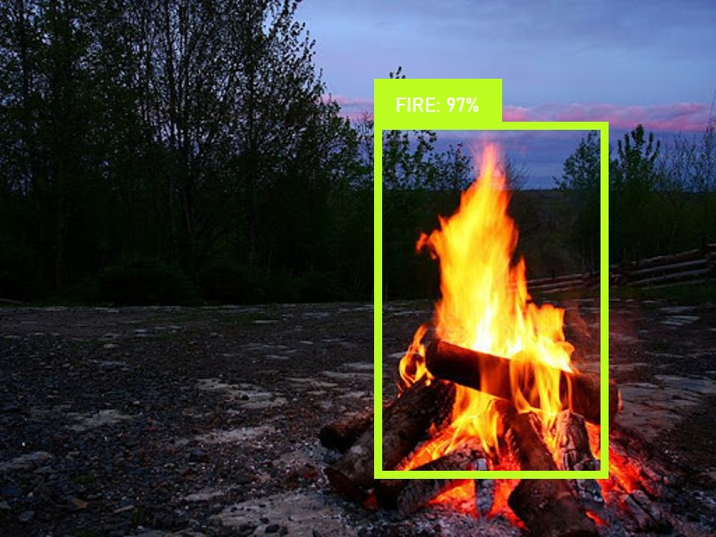

# Fire Detection System

Fire helps us a lot. However, despite the numerous benefits, we face several unexpected fires. In this project, we will build a system to detect fire and respond appropriately.

## To-Do

This project aims and configures the microservices architecture for independent developement that can properly set the tech stacks for each service.

- CCTV
  - Implement CCTV that can transmit every frames of the video to recognize fire.
  - Tech stacks: Raspberry Pi, Django, OpenCV

- Machine Learnig
  - Implement a deep-learning model to detect fire.
  - Implement a server that can deliver information to the android app when the model detects fire.
  - Tech stacks: Tensorflow object detection API, Google Cloud Platform, Django
- Android App
  - Configure UI to notify user's phone(Android), when a fire is detected.
  - Tech stacks: android studio, Django, mySQL

