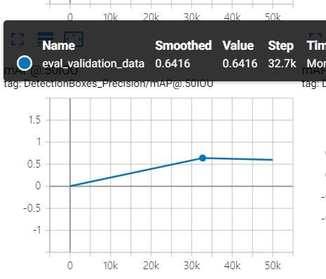
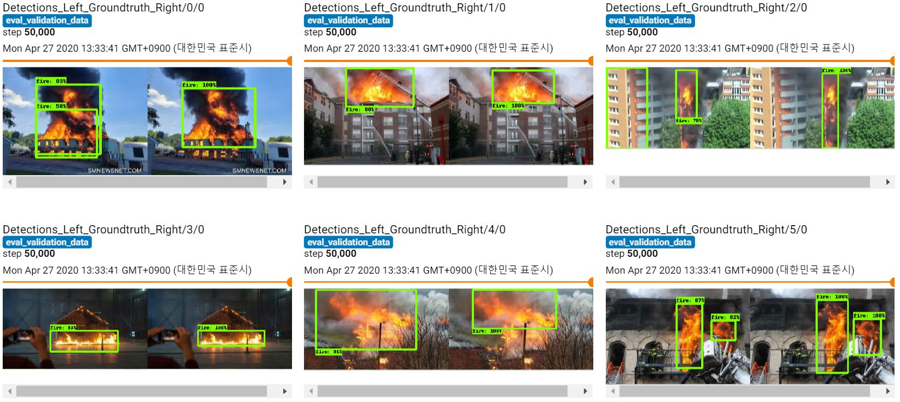
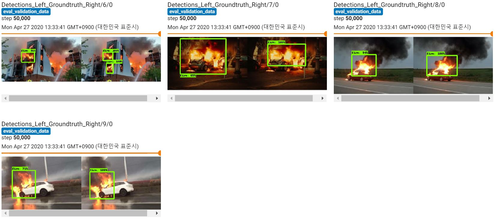

# Training Report

date: 2020 04 27 Mon

model name: MobileNet based Single Shot MultiBox Detector with Pooling Pyramid Network

input image size: 300 x 300

entire steps: 50000

best step: 32700

batch size: 32

number of samples for training: 300

number of samples for validation: 65 

metrics set: coco detection metrics

### mAP@50IOU

**[32700 - best step]**

mAP@50IOU: 64%

loss: 

​	classification: 0.7869

​	localization: 0.4739

​	total: 1.418

### Result

### Comment

need more fire data.